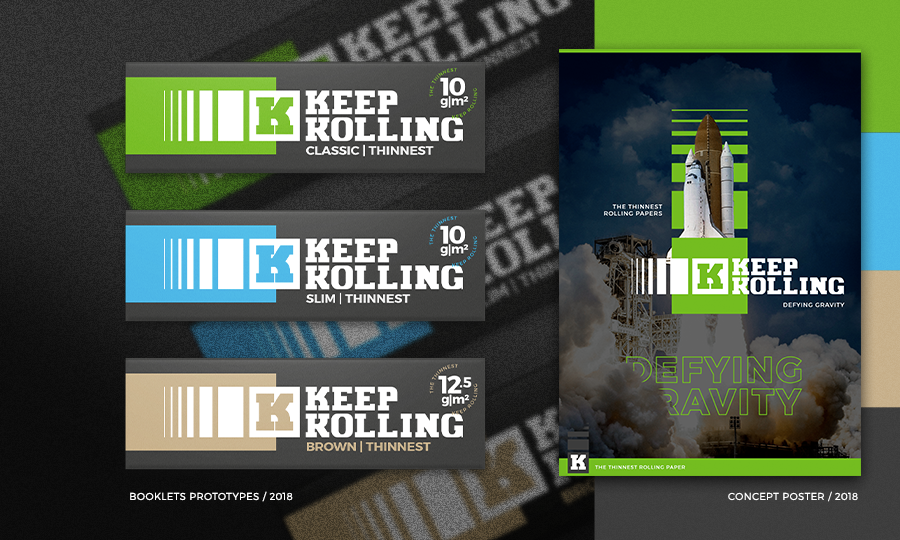
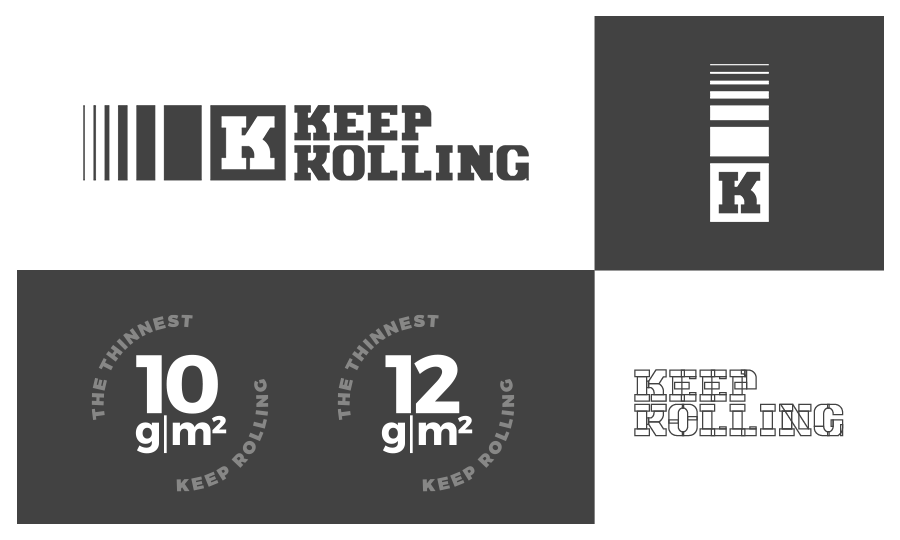
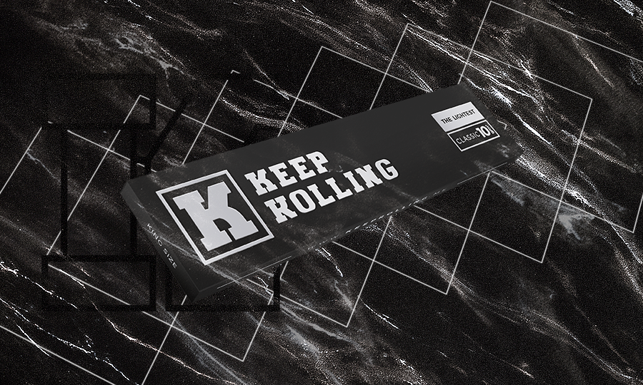
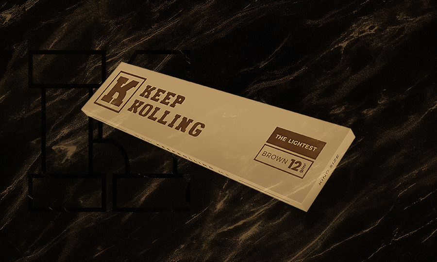
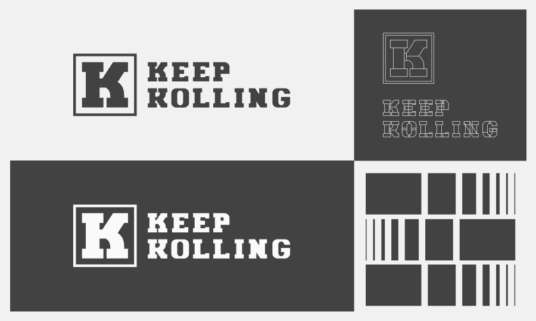

## What

One of the challenges that were set to me a while ago was to built this premium rolling paper brand. At the time, the opportunity arrived in some sort of challenge itself: there were some really specific niche and even more challenging fierce pioneers competitors already.

## Process

The mood was set and despite a couple of on-going branding processes I was picked to optimize, convey and deliver the final concept that the product would turn into. The briefing at the time was looking towards an exclusive, elegant yet minimal and finally bold brand. This brand name was also already picked, the product would be called: Keep Rolling.

I knew I had to go through some concept-storytelling that could embody both the product main feature could set a highly visual potential for scalable purposes, after all we were about the mess with already huge pioneering brands. This concept-storytelling was primarily approved as: *defying gravity.*

## Result

And why dare to challenge the gravity itself? We were talking about this out-of-this-world-&-never-seen-technology for the thinnest rolling paper brand ever so as our core argument we should have been as bold as we could. At the time, the product was as thin as 10g/m² and 12g/m² both Classic and Brown variations.The colors emulate this non-usual space-y product because the product had to thrive through already saturated shelves in PDV (?) and I had this pick in typography for high contrast with the bold serif logotype that were set.

## Feedback

The project went through some others evolutions, a bunch of completely different decisions were made. I designed a whole lot of those booklets, displays and stoytelling 'till the everyone on the team was satisfied enough. That's the main value I added in the project: testing - and both my proudest moment. It's launch was due to 20th August 2019. The latest version of this project, you may find here: [www.keeprolling.me](http://keeprolling.me) or on [social media](https://instagram.com/keeprollingme) already

---