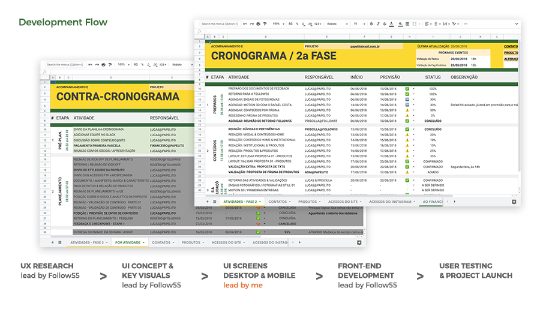
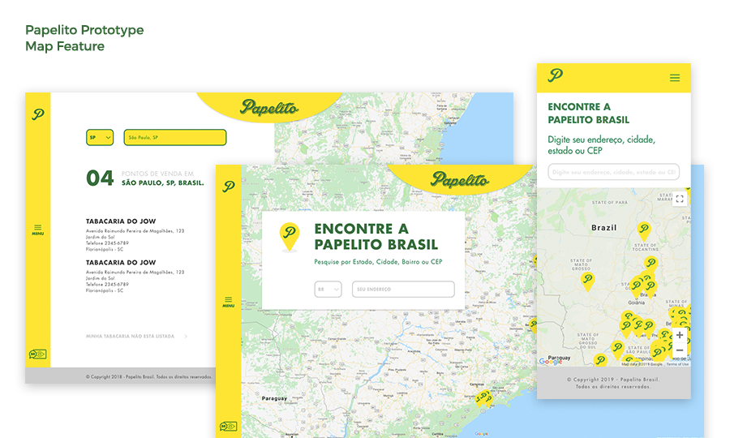

### - tl;dr
>[Papelito Brasil](http://papelitobrasil.com.br) Website

## What

Back in 2017, we were assigned to redesign Papelito Brasil online presence with a help of a specialized team - the digital design studio: [Follow55](http://follow55.com.br) - the initial briefing were made and most of my contribution would be related to managing the client expectations with the tasks of the studio design team.

The goal were to move from a not-optimized-at-all page to an actual modern website that could showcase the products and, since we were on the rise, showcase a scalable product page for every stakeholder acknowledge how massive Papelito Brasil was.

## Process

As suggested by follow55, the project launch flow were set with two parallels development because their team could play their strength and I could contribute to the marketing team in the process too. We had to add a few strategic steps here and there, the project development flow looked like this:

The project went through and most of the UX Research, Benchmark and UX tools were performed by Follow55 design team. They developed a concept with a few key visuals of what the website could have been and even though they have hit the spot in a couple of decisions and we're set to an actual development of the UI.

At this point, even though everyone loved the concept they've made, we shouldn't be waiting for the whole screens to be developed, tested and finally delivered. The site overall experience was already compromised when we first started and as a group we decided to go to a temporary page. It was quite simple with a practical objective in mind: grab attention, grab a few e-mails and set the mood for our next big launch. I designed the page already

The temporary page was already online and it was treated mostly an MVP of the working "look'n feel" everyone were expecting about the page. Naturally, I started designing individual components in Adobe XD for the main site: typography scaling; color system; buttons behavior, icon sheet per level of use and content-boxes; and then major layout components such as header, menu & step-gauge; and finally, designed forms components such as checkboxes and inputs overall.

All set to designing the screens, at the time we already did a screen to screen navigation group exercise and it compiled into a quite simple user journey. On that note, we were dealing with a B2B company, they chose to never sell directly to the final user, this brand website should be as inclusive as possible, so I designed a map feature that could show our stakeholders strength and also be useful to majority of our clients who were looking to reach our product.

I added to the UI a few features such as a scalable product line page divided in 2 main categories: rolling papers and accessories; added a quick authentic paragraph for each product for introduction so the user could always relate a bit more or right on spot tell the difference between them in a few clicks;and also highlighted the product main features that we were always asked for in social media.

## Result

The [page is online](http://papelitobrasil.com.br) and it certainly helped Papelito Brasil to look a lot more professional, a lot closer to everyone and they are moving towards reaching an international market soon.

By only showcasing our best distributors on the Papelito's Map we managed to reach a bunch of potential clients looking forward to work with us, we estimated a 80 to 150 new leads on the first 2 months.

Our already functional SAC 2.0 via social media certainly improved since those trivial users who were only looking for a few confirmations such as "what is this product made of" or "where can i find some of it" were right close to them a few clicks after.

Papelito's website were featured in [CSS Design Awards](https://www.cssdesignawards.com/sites/papelito-brasil/35644) with a 7.07 judge score. And also in [Awwwards](https://www.awwwards.com/sites/papelito-brazil) itself, with a popular score that made our day!

## Feedback

This project taught me a whole lot of soft skills, organization skills and mostly time management since we were always trying to manage two different teams working with different aspects of the same brand.

As for main secondary role, I was thrilled to be challenged with the UI development itself. I learned that not every user need is going to be close to what the client really want and most of my job as a Designer is to consciously separate those challenges, so I can rationalize that and bring them in a unique solution. We reached some of our goals by setting up that map for showcasing brand strength and also be useful for our user's needs.

---